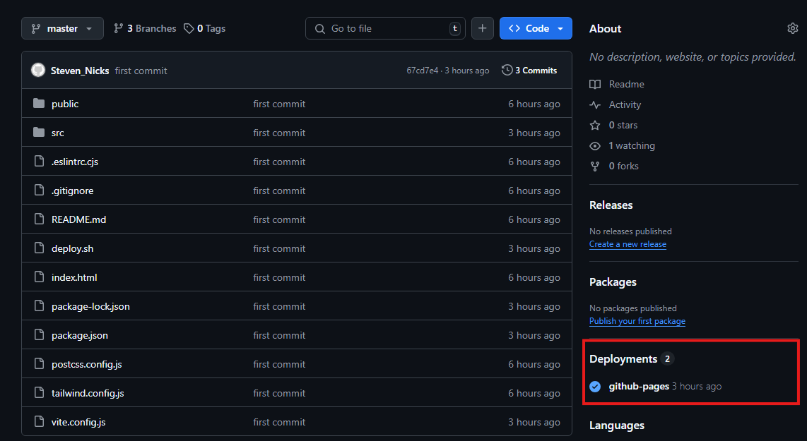

# React + Vite

This template provides a minimal setup to get React working in Vite with HMR and some ESLint rules.

Currently, two official plugins are available:

- [@vitejs/plugin-react](https://github.com/vitejs/vite-plugin-react/blob/main/packages/plugin-react/README.md) uses [Babel](https://babeljs.io/) for Fast Refresh
- [@vitejs/plugin-react-swc](https://github.com/vitejs/vite-plugin-react-swc) uses [SWC](https://swc.rs/) for Fast Refresh


# Instrucciones: despliegue en gh-pages
Generar tu proyecto a producción con el siguiente comando en la terminal

```powershell
npm run build
```

Crea un repositorio del proyecto el cual quieres poner en producción con **GitHub Pages**

```powershell
git init
git add .
git commit -m "first commit"
git remote add origin "link del repositorio"
git push -u origin main
```

## gh-pages

Corre el siguiente comando:

```powershell
npm install gh-pages --save-dev
```

Edita tu **package.json** agregando el siguiente comando:

```powershell
"scripts": {
  "deploy": "gh-pages -d dist"
}
```

información sacada de https://www.npmjs.com/package/gh-pages

## Desplegar en GitHub Pages

Establece una configuración llamada `base` en `vite.config.js` dela siguiente manera:
`base: '<REPO>'`

```powershell
import { defineConfig } from 'vite'
import react from '@vitejs/plugin-react'

// https://vitejs.dev/config/
export default defineConfig({
  plugins: [react()],
  base: 'card-profile-react-vite'
})
```

Crea un archivo llamado `deploy.sh` y pega el siguiente código:

```sh
#!/usr/bin/env sh

# abortar por errores
set -e

# build
npm run build

# navegar al directorio de salida de la compilación
cd dist

# si está implementando en un dominio personalizado
# echo 'www.example.com' > CNAME

git init
git checkout -b main
git add -A
git commit -m 'deploy'

# si está implementando en https: // <USERNAME> .github.io
# git push -f git@github.com:<USERNAME>/<USERNAME>.github.io.git main

# si está implementando en https: // <USERNAME> .github.io / <REPO>
# git push -f git@github.com:<USERNAME>/<REPO>.git main:gh-pages
git push -f git@github.com:S-Alvarad/card-profile-react-vite.git main:gh-pages

cd -
```

Cambia la siguiente linea:

`# git push -f git@github.com:<USERNAME>/<REPO>.git main:gh-pages`

Pones tu nombre de usuario / el nombre del repositorio, ejemplo:

```sh
git push -f git@github.com:S-Alvarad/card-profile-react-vite.git main:gh-pages
```

Nuevamente corres el comando `build`

```powershell
npm run build
```

Ahora corre el comando:

```powershell
npm run deploy
```

Una vez termine de ejecutar ya puedes revisar tu pagina con el link que proporciona github:


